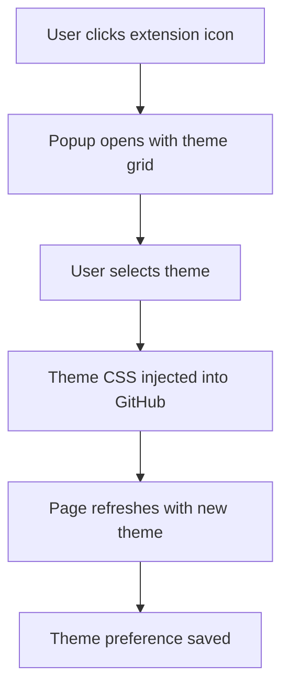
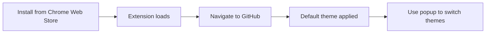

# Chrome GitHub Themes - IDE-Inspired GitHub Styling

> A lightweight Chrome extension that applies popular IDE themes to GitHub's interface for a familiar, developer-friendly experience.

## 🎯 Project Overview

Chrome GitHub Themes transforms GitHub's interface by applying beloved IDE color schemes. Built for developers who want their GitHub experience to match their coding environment's aesthetic.

### Core Value Proposition
- **Instant Theme Switching**: One-click theme changes
- **IDE-Authentic Colors**: Pixel-perfect color matching from popular IDEs
- **Zero Bloat**: Clean, minimal implementation using MVP.css principles
- **Performance First**: CSS-only theming with no JavaScript overhead

## 🚀 Key Features

### Primary Features
- **Popular IDE Themes**: Gruvbox Dark, Molokai, Catppuccin, Solarized, Nord
- **Instant Application**: Themes apply immediately on GitHub pages
- **Persistent Settings**: Theme choice saved across sessions
- **Simple Toggle**: Easy theme switching via extension popup

### Technical Features
- **CSS Custom Properties**: Clean, maintainable theme system
- **Minimal JavaScript**: Only for settings management
- **GitHub-Specific**: Optimized selectors for GitHub's DOM structure
- **Performance Optimized**: Efficient CSS delivery and parsing

## 🎨 Design Philosophy

### UI/UX Principles
- **Familiar Colors**: Exact color matches from popular IDEs
- **Minimal Interface**: Clean settings popup with theme previews
- **Developer Experience**: Themes that reduce eye strain during long coding sessions
- **Consistency**: Uniform theming across all GitHub pages

### Technical Architecture
- **CSS-First**: Theming handled entirely through stylesheets
- **Modular Themes**: Each theme as a separate CSS file
- **MVP.css Inspired**: Minimal, semantic styling approach
- **No Dependencies**: Pure vanilla implementation

## 🛠️ Technical Implementation

### Extension Structure
```
chrome-github-themes/
├── manifest.json              # Extension configuration
├── background/
│   └── service-worker.js     # Minimal background script
├── content/
│   └── theme-injector.js     # Theme CSS injection
├── popup/
│   ├── popup.html           # Theme selection interface
│   ├── popup.js             # Settings management
│   └── popup.css            # MVP.css-inspired styling
├── themes/
│   ├── gruvbox-dark.css
│   ├── molokai.css
│   ├── catppuccin-mocha.css
│   ├── solarized-dark.css
│   ├── nord.css
│   └── base.css             # Common GitHub overrides
├── assets/
│   ├── icons/               # Extension icons (SVG + PNG files)
│   └── previews/            # Theme preview images
└── docs/
    └── README.md
```

### Core Technologies
- **Manifest V3**: Modern Chrome extension architecture
- **Chrome APIs**:
  - `chrome.storage` for theme persistence
  - `chrome.tabs` for CSS injection
- **Pure CSS**: No framework dependencies
- **CSS Custom Properties**: Dynamic theme switching

## 🎨 Theme System

### Supported Themes

1. **Gruvbox Dark**
   - Background: `#282828`
   - Foreground: `#ebdbb2`
   - Accent: `#fabd2f`
   - Error: `#fb4934`

2. **Molokai**
   - Background: `#1b1d1e`
   - Foreground: `#f8f8f2`
   - Accent: `#ae81ff`
   - Error: `#f92672`

3. **Catppuccin Mocha**
   - Background: `#1e1e2e`
   - Foreground: `#cdd6f4`
   - Accent: `#89b4fa`
   - Error: `#f38ba8`

4. **Solarized Dark**
   - Background: `#002b36`
   - Foreground: `#839496`
   - Accent: `#268bd2`
   - Error: `#dc322f`

5. **Nord**
   - Background: `#2e3440`
   - Foreground: `#d8dee9`
   - Accent: `#88c0d0`
   - Error: `#bf616a`

### Theme Implementation
```css
/* Base GitHub overrides */
:root {
  --gh-bg-primary: var(--theme-bg);
  --gh-fg-primary: var(--theme-fg);
  --gh-accent: var(--theme-accent);
  --gh-border: var(--theme-border);
  --gh-error: var(--theme-error);
}

/* GitHub-specific selectors */
.Header { background: var(--gh-bg-primary) !important; }
.repository-content { background: var(--gh-bg-primary) !important; }
.js-file-line-container { background: var(--gh-bg-primary) !important; }
```

## 🎮 User Experience Flow

### Theme Selection Flow


### Installation Flow


## ⚙️ Configuration Options

### Theme Settings
- **Theme Selection**: Grid of theme previews
- **Auto-apply**: Themes apply instantly to open GitHub tabs
- **Reset Option**: Return to GitHub's default theme
- **Theme Persistence**: Remembers choice across browser sessions

### Popup Interface
- **Theme Grid**: Visual preview of each theme
- **Current Theme**: Highlighted active selection
- **Quick Switch**: One-click theme changes
- **Minimal Design**: Clean, distraction-free interface

## 📋 Development Roadmap

### Phase 1: Core Implementation (Week 1)
- [ ] Basic extension structure and manifest
- [ ] Create SVG icon and convert to PNG files
- [ ] Theme CSS creation for 5 popular themes
- [ ] CSS injection system
- [ ] Simple popup interface

### Phase 2: Polish & Testing (Week 2)
- [ ] Theme previews in popup
- [ ] Settings persistence
- [ ] GitHub DOM compatibility testing
- [ ] Performance optimization

### Phase 3: Release Preparation (Week 3)
- [ ] Chrome Web Store assets
- [ ] Documentation and screenshots
- [ ] Final testing across GitHub features
- [ ] Package for distribution

## 🧪 Testing Strategy

### Compatibility Testing
- GitHub repository pages
- Pull request interfaces
- Issue tracking pages
- GitHub Actions pages
- Settings and profile pages

### Performance Testing
- CSS injection speed
- Memory usage impact
- Theme switching responsiveness
- Large repository handling

### Visual Testing
- Color accuracy vs IDE themes
- Readability in different lighting
- Accessibility compliance
- Cross-browser consistency

## 🔧 Development Setup

### Prerequisites
- Chrome Browser (latest stable)
- Code editor with CSS support
- GitHub account for testing

### Installation Steps
1. Clone repository
2. Load in Chrome: `chrome://extensions/` → Developer mode → Load unpacked
3. Navigate to GitHub to test themes

### Development Commands
```bash
# Watch for CSS changes
npm run dev

# Build for production
npm run build

# Package for Chrome Web Store
npm run package

# Lint CSS
npm run lint
```

## 📊 Success Metrics

### Technical Metrics
- **Performance**: <10ms theme application time
- **Memory**: <5MB RAM usage
- **Compatibility**: Works across all GitHub pages
- **Reliability**: 100% theme persistence

### User Experience Metrics
- **Adoption**: Install-to-active-use ratio
- **Engagement**: Theme switching frequency
- **Satisfaction**: User ratings and reviews
- **Retention**: Weekly active users

## 🚀 Future Enhancements

### Additional Themes
- **VS Code Themes**: Dark+, Light+, High Contrast
- **Vim Themes**: Vim-airline, Powerline
- **Custom Themes**: User-defined color schemes
- **Seasonal Themes**: Holiday and seasonal variations

### Advanced Features
- **Syntax Highlighting**: Enhanced code block styling
- **Custom Fonts**: Typography options for code blocks
- **Theme Scheduling**: Automatic light/dark switching
- **Export/Import**: Share custom themes

## 📄 Documentation Requirements

### User Documentation
- **Installation Guide**: Chrome Web Store installation
- **Theme Guide**: Overview of available themes
- **Troubleshooting**: Common issues and solutions

### Developer Documentation
- **Theme Creation**: How to add new themes
- **Icon Creation**: Simple SVG design and ImageMagick conversion
- **CSS Selectors**: GitHub-specific styling targets
- **Contributing**: Development setup and guidelines

## 🎯 Success Definition

The Chrome GitHub Themes extension is successful when:
- Themes accurately replicate popular IDE color schemes
- GitHub's interface feels native with applied themes
- Theme switching is instantaneous and reliable
- The extension feels lightweight and unobtrusive
- Developers prefer GitHub with themes over default styling

## 🔧 Using This as a Template

This project is designed to be used as a template for creating Chrome extensions that theme websites. The architecture is modular and can be adapted for other sites beyond GitHub.

### Template Features

- **Simple Icon Creation**: SVG design with ImageMagick PNG conversion
- **Modular Theme System**: CSS custom properties for easy theme creation
- **Clean Architecture**: Manifest V3 with proper separation of concerns
- **Development Tools**: Build scripts, linting, and packaging
- **Complete Documentation**: Ready-to-use docs and contribution guides

### Adapting for Other Sites

1. **Change Target Domain**
   ```json
   // manifest.json
   "host_permissions": [
     "https://yoursite.com/*"
   ],
   "content_scripts": [
     {
       "matches": ["https://yoursite.com/*"],
       // ...
     }
   ]
   ```

2. **Update Base CSS**
   ```css
   /* themes/base.css */
   /* Replace GitHub selectors with your target site */
   .your-site-header {
     background-color: var(--theme-bg-primary) !important;
   }
   ```

3. **Create Custom Icon**
   ```bash
   # Edit assets/icons/icon.svg to match your site
   # Convert to PNG: convert -background transparent -resize 16x16 icon.svg icon16.png
   # Repeat for 32x32, 48x48, 128x128
   ```

4. **Update Extension Metadata**
   ```json
   // manifest.json
   "name": "Your Site Themes",
   "description": "Apply IDE themes to YourSite's interface"
   ```

### Quick Template Setup

```bash
# Clone the template
git clone https://github.com/yourusername/chrome-github-themes.git my-extension
cd my-extension

# Customize for your site
# - Edit manifest.json (name, permissions, host_permissions)
# - Update themes/base.css with your site's selectors
# - Modify popup/popup.html branding
# - Update README.md and docs

# Test your extension
# Load in Chrome and test on your target site
```

### Template Benefits

- ✅ **Production Ready**: Includes all Chrome Web Store requirements
- ✅ **Best Practices**: Manifest V3, proper permissions, performance optimized
- ✅ **Simple Tooling**: Build scripts, linting, and packaging
- ✅ **Complete Documentation**: User guides, developer docs, contribution guidelines
- ✅ **Theme System**: Easy to add new themes and customize colors
- ✅ **Cross-Browser**: Works on all Chromium-based browsers

---

*This extension brings the comfort of familiar IDE themes to GitHub, making code review and repository browsing a more pleasant experience for developers who spend their days in themed editors.*
